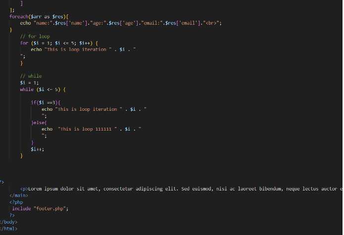
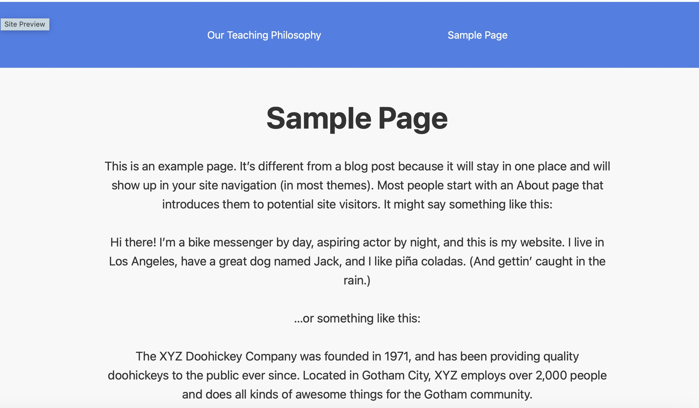
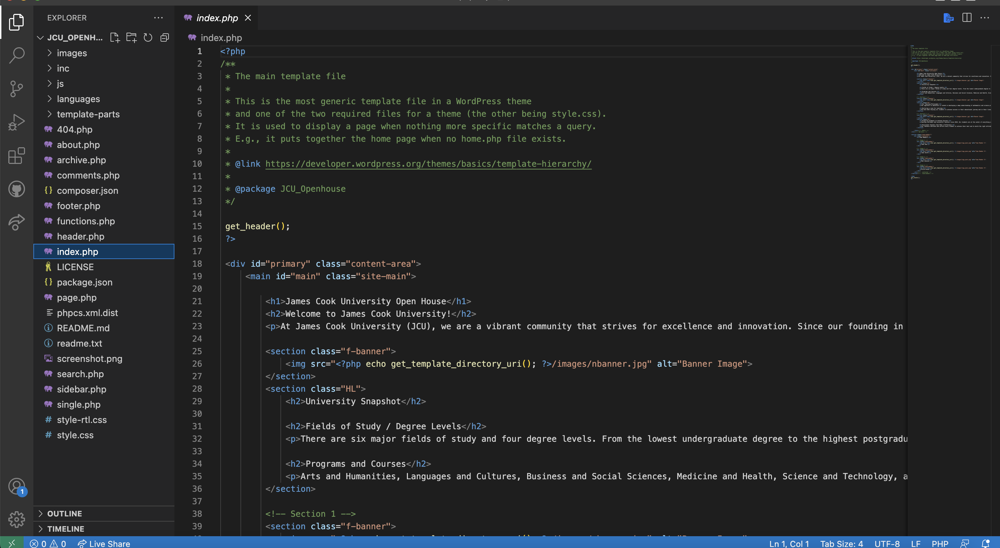
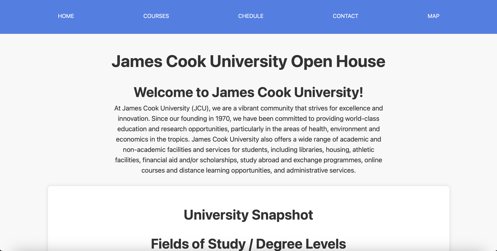
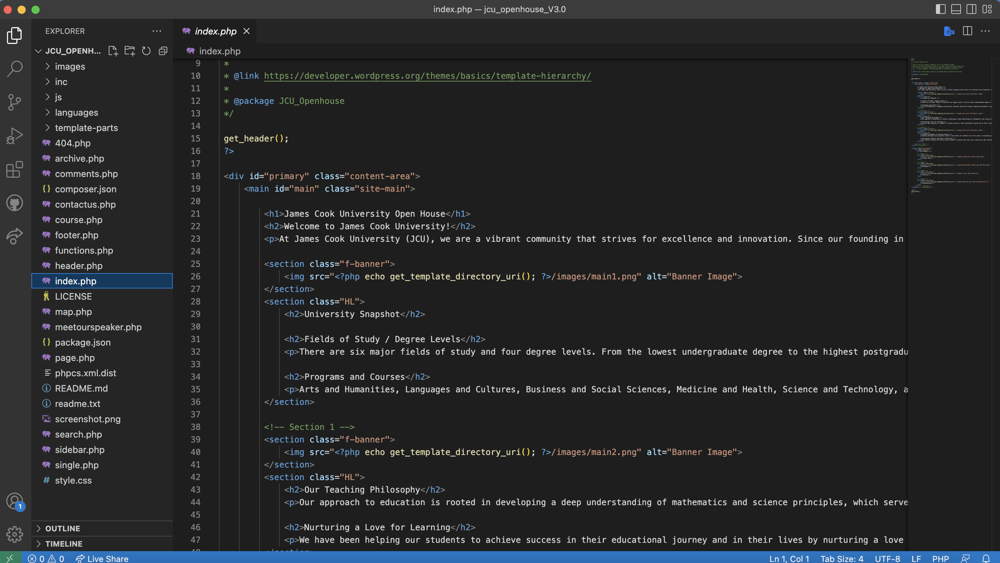

# Task Overview
This repository contains the new theme we have developed for the JCU Openhouse website: JCU-Openhouse, and documentation for the deployment of theme on to your own site, the schematic for the theme and the website.

JCU Openhouse is a group of professional teachers in Singapore who provide course selection services, course selection consultation services for students on campus, and course introduction services for prospective college students who want to study at JCU, this website was created using Underscores.me as its base and was completed by the students of James Cook University.

# Team Members
- Lu Zhixian- 14161321
- Mu TianGao- 14167990
- Nickson Tanjodi- 14289802
- Xinmeng Yang- 14276824

# Version Conrol
**version V1.0**

**version V2.0**

**version V3.0**

# Pages
**Homepage:** The homepage is the login page of our website; This is the default page they use when accessing the website. Our homepage contains a brief introduction to the school. And a teaching philosophy module, providing a brief description of the educational quality and philosophy of the school. And the photos of our team members at the bottom of the page.

**Course**: The course page displays the courses offered by the school and provides a brief description of the project courses, allowing users to have a more intuitive understanding of the course design.

**Schedlue**: This page showcases the responsible persons for relevant courses in our school and showcases our strong teaching staff. And consultation time is provided to facilitate customers who want to have a deeper understanding of the relevant courses.

**Contact:** The Contact Us page contains a form that collects the contact details of the user as well as any queries or questions they may have (in the message section). 

**Map**: The page shows us a map on the page which displays the location of JCU campus in Singapore based on the address provided to us by the client. 

# Coding
**PHP**:  PHP is a widely-used, open-source scripting language especially suited for web development. Embedded into HTML, it enables the creation of dynamic and interactive websites. PHP scripts are executed on the server, generating HTML which is then sent to the client's browser, allowing for the creation of content that can change each time the page is loaded.It's known for its ease of use for beginners, yet powerful enough for advanced programming, making it a popular choice for web developers. 

# Further Development
To facilitate ongoing development and customization of our website, we employ to using the child themes of our site. Child themes in WordPress are a method of customizing and enhancing a parent theme without altering its original code, offering a blend of safety, flexibility, and ease of use. They inherit the functionality and styling of the parent theme, allowing for customization in design and functionality without the risk of losing changes during updates. Creating a child theme is straightforward, typically requiring only a stylesheet and a functions.php file. This approach is considered a best practice in WordPress development, as it maintains the integrity of the parent theme while providing a safe environment to experiment with different designs and functionalities. However, the effectiveness of a child theme largely depends on the proper coding of the parent theme and can slightly impact site performance depending on how it's coded.

# Theme Origin
**Underscores.me** It's a popular starter theme for WordPress, designed for developers as a base to build upon and customize for unique website designs. It's a lightweight and minimalistic framework that provides a solid foundation for developing WordPress themes. Underscores comes with a well-organized set of PHP, CSS, and JavaScript files, making it easy for us to understand and modify. It adheres to WordPress coding standards and best practices, ensuring compatibility and efficiency. The theme includes essential templates and functions, but lacks styling and design elements, which encourages developers to create their own unique look and feel. It's particularly favored for its clean, efficient code and responsive layout, which forms an ideal starting point for both simple and complex WordPress themes. By using Underscores as a template,  we can significantly speed up their development process, focusing more on customization and creative design rather than on building everything from scratch.

# Theme Features
The theme follows several guidelines in the building of a theme template, where the whitespaces had been managed identically, and the padding and margin all remain exactly the same for every single page. This was to ensure uniformity and cleanliness throughout the entire site.

# Design
Our website's design aesthetic centers around delivering a clean and uncluttered user experience. By prioritizing minimalism and a uniform colour scheme, we create an environment that focuses on essential information while maintaining an appealing visual appeal. This documentation outlines key design elements, such as a text-centric approach, limited use of images, and consistent margins and padding across all pages and viewports.

**Text Centric Approach**: To ensure a content-driven experience, we have intentionally placed emphasis on textual information throughout the website. By presenting information primarily through well-crafted and concise text, we allow visitors to easily digest and engage with the content. This approach fosters a sense of clarity and enables users to quickly find the information they seek.

**Limiting Images**: While images play a supporting role in enhancing the textual content, we have intentionally avoided cluttering the website with excessive visuals. By judiciously selecting and thoughtfully incorporating relevant images, we strike a balance between providing visual context and maintaining a streamlined design. This approach allows for faster loading times and a focused user experience.

**Clean Visuals**: The website's aesthetic exudes a rustic and clean vibe, promoting a sense of simplicity and elegance. With a carefully curated colour palette, we maintain a consistent and harmonious visual experience across all pages. By employing neutral tones and understated elements, we create a visually cohesive environment that is pleasing to the eye.

**Uniformity**: To achieve a polished and organized appearance, we have implemented uniform margins and padding on all pages, regardless of the viewport or device. Consistency in spacing ensures a balanced layout and contributes to an overall sense of professionalism. By meticulously maintaining these design principles, we guarantee a visually pleasing experience for all users.

# Typography
**Font**: In order to achieve a visually appealing and user-friendly experience, our website incorporates a standardized font theme. The chosen typeface, 'Montserrat,' stands out for its clean and easily readable structure, making it an ideal choice for enhancing the overall aesthetics and legibility of our content.

**Headings**: For the headings displayed on each section of the website, we have employed a font size ranging from 24 to 28 points or, alternatively, utilized the H2 tag. This deliberate approach ensures that the headings effectively capture attention and provide a clear visual hierarchy, guiding users through the content seamlessly.

**Written Content**: With a keen focus on user convenience, the standardized font size for the majority of the written content has been set to approximately 12 points. This careful selection maintains consistency throughout the website, enabling effortless readability for visitors across various devices and screen sizes.

**Fallback Option**: While 'Montserrat' is our preferred font choice, it is essential to maintain optimal readability even in situations where it may not be available. In such cases, we prioritize using any readable 'sans-serif' font as a suitable fallback option, ensuring that the content remains easily accessible and visually pleasing to our audience.

**Colours**: The colour scheme of a website plays a vital role in creating an engaging and visually cohesive user experience. Our website incorporates a carefully selected palette of primary colours to achieve a harmonious and aesthetically pleasing design. This documentation outlines the specific colour choices and their application throughout the site, ensuring readability and visual appeal.

# Applications and Processes
Efficient communication and seamless project management are paramount for the success of any collaborative endeavour. In our workflow, we have employed Slack, Trello, and GitHub as integral tools to facilitate daily communication, track progress, and manage our project effectively. Here provides an overview of each platform's role in supporting our team's collaboration and productivity.

**Slack**: Slack serves as our primary platform for daily communication and collaboration. Its versatile features enable us to share important links, provide updates, plan meetings, and exchange ideas, tutorials, and designs seamlessly. By utilizing Slack's text channels, voice channels, and direct messaging capabilities, we ensure effective and efficient communication within our team.

**Trello**: To maintain organized project management, we rely on Trellp as our go-to tool. Trello's flexible and customizable interface allows us to create a centralized workspace where we can track tasks, monitor progress, and collaborate on various project aspects. Through Trello, we allocate tasks, define deadlines, and track completed tasks, ensuring transparency and accountability among team members.

**GitHub**: GitHub serves as our dedicated platform for version control and repository management. With GitHub, we create a repository where we store our project files, including the website's details, content, and associated assets. This enables us to effectively manage different versions of the project, collaborate on code development, and seamlessly integrate changes made by team members.

# Hosting and Deployment
**SiteGround**: SiteGround is a web hosting company known for its focus on hosting-related services. Renowned for its user-friendly interface, SiteGround caters to both beginners and advanced users, offering a range of hosting options including shared hosting, cloud hosting, and dedicated servers. One of its standout features is the high-quality customer support, which is often praised for its responsiveness and helpfulness. Additionally, SiteGround is recognized for its commitment to security and speed, implementing cutting-edge technologies like SSD drives and custom software solutions to enhance website performance and reliability. Their hosting plans also typically include WordPress-specific features, making them a preferred choice for WordPress users.

In comparison, Amazon Web Services (AWS) is a subsidiary of Amazon providing on-demand cloud computing platforms and APIs to individuals, companies, and governments, on a metered pay-as-you-go basis. AWS offers a more comprehensive set of services and solutions, including computing power, storage options, and networking capabilities, catering to a broader range of business needs from small startups to large enterprises. Unlike SiteGround, AWS is not solely focused on web hosting; it’s a more complex and flexible cloud service platform that offers a wider variety of infrastructure services. This complexity, however, can make AWS less user-friendly for beginners or those with limited technical expertise. In terms of pricing, AWS's pay-as-you-go model can be more cost-effective for scalable and high-traffic projects, while SiteGround offers straightforward fixed pricing plans, which might be more predictable and easier to manage for smaller projects or fixed-budget scenarios.

# Project Management
To streamline our website development process and ensure efficient task management, we adopted Trello as our project management tool. Leveraging the Kanban framework within Trello, we organized our tasks into three sections, allowing us to track items, visualize progress, and efficiently manage our project. This documentation outlines our use of Trello and the benefits it brought to our development workflow.

**Trello**: Trello is a versatile and collaborative workspace that offers a wide range of features for project management. By utilizing Trello, we were able to create an organized and centralized platform to track and manage our development tasks. Its intuitive interface and extensive customization options allowed us to tailor the workspace to our specific project needs.

**Kanban**: Within Trello, we implemented the Kanban framework to visualize our project's workflow. This framework organizes tasks into three distinct sections: "To Do," "In Progress," and "Completed." Each section represents a different stage of the development process. This visual representation provided us with a clear overview of our project's progress and helped us identify any bottlenecks or areas that required attention.

**Overall Flow**: Trello's comprehensive feature set enabled us to create an overall flow for our project based on the tasks we needed to accomplish. By visualizing the project timeline, identifying dependencies, and assigning priorities, we optimized our development process. Additionally, the collaborative nature of Trello allowed team members to actively communicate, provide feedback, and address any challenges or roadblocks that arose during the development phase.

# Enviornment Overview
**Local Environment**: This environment is typically used for development, testing, and debugging purposes, allowing developers and designers to work on and modify the website without affecting the live version. It involves installing a software stack like XAMPP that includes an Apache server, MySQL database, and PHP, which are necessary to run WordPress. This local setup allows for quicker development, as changes can be immediately seen without the need for uploading files to a server. Ensuring that the live site remains stable and unaffected by any potential issues. Once the development or testing is complete, the site can be migrated from the local environment to a live hosting server for public access.

**XAMPP**: Choosing XAMPP as a local development environment for web projects, including WordPress websites, is primarily due to its simplicity, versatility, and cross-platform compatibility. It is favored because it simplifies the process of setting up a local server environment, eliminating the need for individual installation and configuration of these components.  It's particularly useful for beginners due to its user-friendly interface and ease of use, allowing for quick setup and minimal configuration. Developers often choose XAMPP to develop and test their websites and applications locally before deploying them to a live server, ensuring that any issues can be resolved in a controlled and private environment. Additionally, XAMPP's widespread use and supportive community provide a wealth of resources and troubleshooting assistance.

